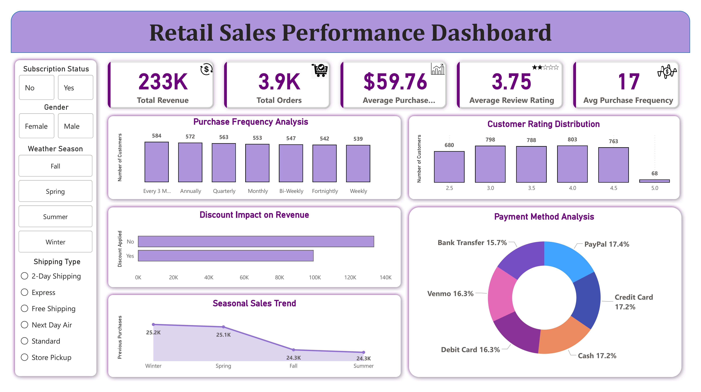
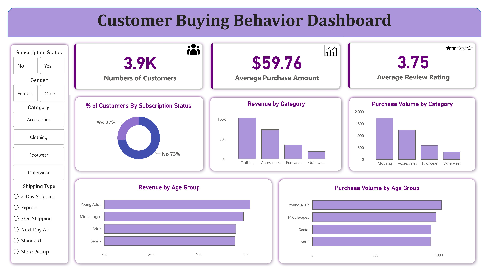

# Retail Customer Analytics

An end-to-end data analytics project focused on understanding customer shopping behavior and retail sales performance. The project combines Python for data preparation, MySQL for business analysis, and Power BI for interactive dashboarding to uncover insights into customer purchasing patterns, product performance, subscription behavior, and revenue trends.

---

## Project Overview

Retail businesses generate large volumes of customer transaction data, but turning that data into actionable insights requires proper analysis and visualization.

This project analyzes 3,900 customer purchase records to answer key business questions such as:

- Which customer groups generate the most revenue?
- Do subscribers spend more than non-subscribers?
- Which products receive the highest ratings?
- How do discounts impact revenue?
- What are the purchasing patterns across age groups and product categories?

The final output consists of two interactive Power BI dashboards designed for both business performance monitoring and customer behavior analysis.

---

## Dataset Information

| Attribute | Details |
|------------|------------|
| Records | 3,900 |
| Features | 18 |
| Domain | Retail / Customer Analytics |
| Data Type | Customer Shopping Behavior |

### Key Columns

- Customer ID
- Age
- Gender
- Category
- Item Purchased
- Purchase Amount
- Subscription Status
- Discount Applied
- Previous Purchases
- Review Rating
- Shipping Type
- Season
- Frequency of Purchases
- Color
- Size

---

## Project Workflow

### 1. Data Cleaning & Preparation (Python)

The raw dataset was processed using Python and Pandas.

#### Tasks Performed

- Loaded dataset using Pandas
- Performed exploratory data analysis
- Identified missing values
- Imputed missing values in Review Rating
- Renamed columns using snake_case convention
- Created Age Group categories
- Generated purchase frequency features
- Removed redundant columns
- Validated data consistency
- Prepared dataset for database integration

### Technologies Used

- Python
- Pandas
- NumPy
- Jupyter Notebook

---

### 2. Business Analysis (MySQL)

After cleaning, the dataset was loaded into MySQL for analytical querying.

The following business questions were explored:

#### Revenue Analysis
- Revenue by Gender
- Revenue by Age Group

#### Customer Analysis
- Subscriber vs Non-Subscriber Spending
- Repeat Buyer Subscription Trends
- Customer Segmentation

#### Product Analysis
- Top Rated Products
- Top Products by Category
- Discount-Dependent Products

#### Shipping Analysis
- Standard vs Express Shipping Comparison

#### Discount Analysis
- High-Spending Discount Users
- Impact of Discounts on Purchases

### Technologies Used

- MySQL
- SQL Queries
- Window Functions
- Aggregations
- Customer Segmentation Logic

---

### 3. Interactive Dashboards (Power BI)

The analyzed data was connected to Power BI to build interactive dashboards that provide actionable business insights.

---

# Dashboard 1: Retail Sales Performance Dashboard

This dashboard focuses on overall business performance and revenue-related insights.

### Key KPIs

- Total Revenue
- Total Orders
- Average Purchase Amount
- Average Review Rating
- Average Purchase Frequency

### Insights Included

- Purchase Frequency Analysis
- Customer Rating Distribution
- Discount Impact on Revenue
- Payment Method Analysis
- Seasonal Sales Trends

---

# Dashboard 2: Customer Buying Behavior Dashboard

This dashboard focuses on customer preferences, purchasing behavior, and demographic analysis.

### Key KPIs

- Number of Customers
- Average Purchase Amount
- Average Review Rating

### Insights Included

- Customer Subscription Distribution
- Revenue by Category
- Purchase Volume by Category
- Revenue by Age Group
- Purchase Volume by Age Group

---

## Business Insights

The analysis revealed several valuable insights:

### Customer Behavior

- A majority of customers are non-subscribers.
- Certain age groups contribute significantly more revenue.
- Repeat buyers demonstrate stronger engagement patterns.

### Product Performance

- Clothing generated the highest revenue.
- Product ratings help identify customer-preferred products.
- Purchase volumes vary significantly across categories.

### Revenue Trends

- Revenue remains relatively consistent across seasons.
- Discounts contribute to purchase volume but require margin monitoring.

### Marketing Opportunities

- Improve subscriber acquisition strategies.
- Reward loyal customers through targeted loyalty programs.
- Promote top-rated products more aggressively.
- Focus campaigns on high-revenue customer segments.

---

## Tech Stack

| Category | Tools |
|-----------|---------|
| Programming | Python |
| Data Analysis | Pandas, NumPy |
| Database | MySQL |
| Visualization | Power BI |
| Development Environment | Jupyter Notebook |
| Dataset Format | Excel / CSV |

---

## Future Improvements

- Customer Lifetime Value (CLV) Analysis
- RFM Customer Segmentation
- Predictive Purchase Modeling
- Customer Churn Prediction
- Real-Time Dashboard Integration
- Advanced DAX Measures

---

## Conclusion

This project demonstrates a complete analytics workflow, from raw data preparation and SQL-based business analysis to interactive dashboard development. By combining Python, MySQL, and Power BI, the project transforms transactional customer data into meaningful business insights that support data-driven decision-making.
